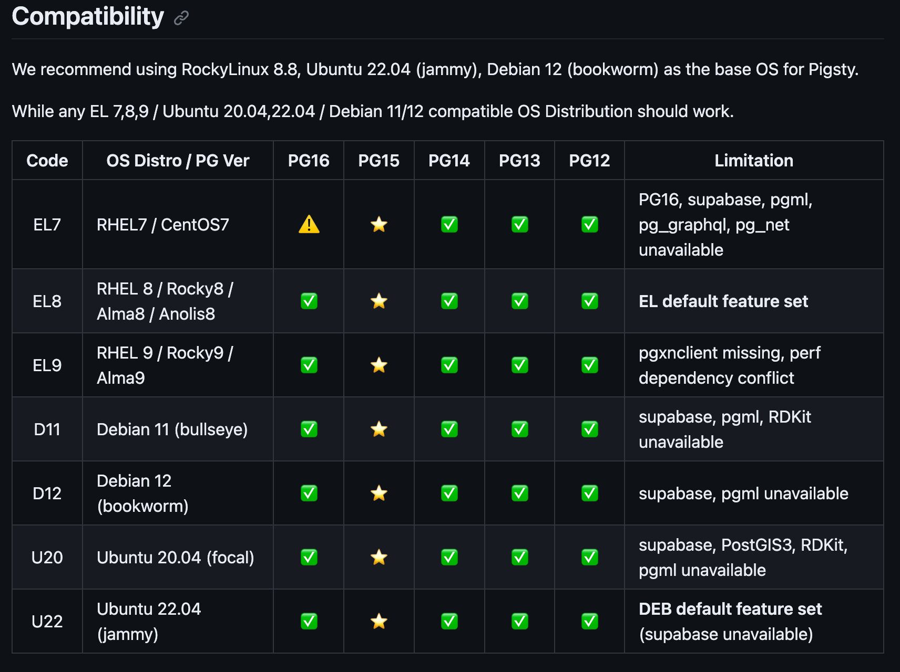
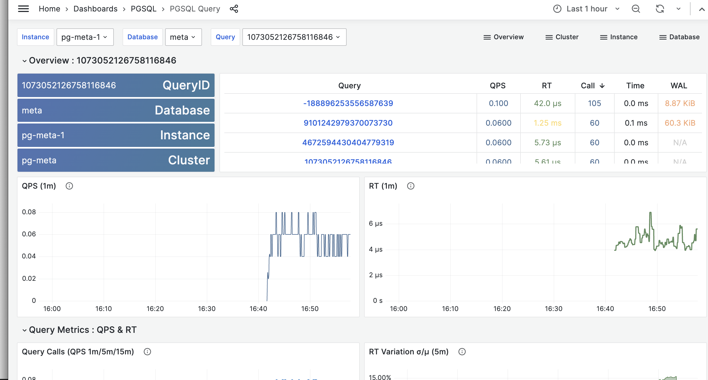

# Installing Pigsty

We want to use [Rocky Linux 8.8](https://wiki.rockylinux.org/rocky/version/), per their recommendation:



## Installation Steps 

1. **Install the prerequisites:**  
    Use the following commands to install the necessary prerequisites:
    ```bash
    yum update -y
    yum install tar -y
    dnf install epel-release -y
    dnf upgrade -y -v
    ```
2. **Download the Pigsty source code:**  
    Use the following command to download the Pigsty source code:
    ```bash
    sudo curl -fsSL https://get.pigsty.cc/latest | bash
    ```
    This will download the Pigsty source code to your home directory and extract it.

3. **Bootstrap Pigsty:**  
    The bootstrap script will download and install the Ansible dependencies. To run the bootstrap script, execute the following commands:
    ```bash
    cd ~/pigsty
    chmod +x bootstrap # Use to get permission from root to install
    sudo ./bootstrap
    ```
    You can press "y" to continue Bootstrap Pigsty

4. **Configure Pigsty:**  
    The configure script will create a pigsty.yml configuration file based on your environment. To run the configure script, execute the following commands:
    ```bash
    chmod +x configure # Use to get permission from root to install
    sudo ./configure
    ```
    When prompted, enter the following information:  
    IP address: Enter the IP address of your V.P.S.  

5. **Install Pigsty**

    To install Pigsty, execute the following command:
    ```bash
    sudo ./install.yml
    ```
    This will install Pigsty on your V.P.S. and create a PostgreSQL database cluster.

6. **Access Pigsty**

    Once Pigsty is installed, you can access it at ```http://<your-ip-address>:3000```.

**Notes**:

using the latest (2.5.0) from Github, as the website doesn’t appear to be updated: https://github.com/Vonng/pigsty

For a quick and efficient installation, you may refer to step-by-step tutorial video. This comprehensive guide will help you complete the installation process in approximately 5 minutes: https://asciinema.org/a/603609


# Questions on Pigsty

See issue: https://github.com/BuildRemote/stackgres-to-pigsty/issues/1

## How to run single vs. multi-node
### Running Pigsty in Single Node

Before proceeding to step 5 of the installation process, follow these additional steps to configure Pigsty for single node operation.

1. **Edit the Configuration File:**

    Open the pigsty.yml configuration file in a text editor:
    ```bash
    vi pigsty.yml
    ```
    Change the following lines:
    ```bash
    #minio: { hosts: {   <your-ip-address>: { minio_seq: 1 } }, vars: { minio_cluster: minio } }
    minio: { hosts: {   <your-ip-address>: { minio_seq: 1 } }, vars: { minio_cluster: minio } }
    #pgbackrest_method: minio
    pgbackrest_method: minio
    ```
    To save the changes and exit the editor, press `ESC`, type `:wq` and hit `ENTER`.
2. **Proceed with the Installation:**

    After making these changes, you can proceed with step 5 of the installation process.

    Once the installation is complete, you can verify that PostgreSQL is running on your VPS by executing:
    ```bash
    psql postgres://dbuser_dba:DBUser.DBA@<your-ip-address>:5432/meta
    ```
### Running Pigsty in Multi-node

Before proceeding to step 5 of the installation process, follow these additional steps to configure Pigsty for multi-node operation.

1. **Edit the Configuration File:**

    Open the pigsty.yml configuration file in a text editor:
    ```bash
    vi pigsty.yml
    ```
    You can find out these lines:
    ```bash
    pg_libs: 'pg_stat_statements, auto_explain' # add extra extensions to shared_preload_libraries
    node_crontab: [ '00 01 * * * postgres /pg/bin/pg-backup full' ] # make a full backup every 1am

    # ***************** You can add new lines here ******************

    vars:                               # global parameters
    version: v2.5.0                   # pigsty version string
    ```
    Insert the following scripts, customizing the IP addresses and other parameters as needed:
    ```bash
    # pgsql 3 node ha cluster: pg-test
    pg-test:      
      hosts:
        <node1-ip-address>: { pg_seq: 1, pg_role: primary }   # primary instance, leader of cluster            
        <node2-ip-address>: { pg_seq: 2, pg_role: replica }   # replica instance, follower of leader
        <node3-ip-address>: { pg_seq: 3, pg_role: replica, pg_offline_query: true } # replica with offline access
      vars:
        pg_cluster: pg-test  # define pgsql cluster name
    ```
2. **Add the New Node:**

    Execute the following command:
    ```bash
    bin/node-add pg-test
    ```
    After executing this command, you can check each node's yml file to confirm it was generated successfully:
    ```bash
    ls /etc/prometheus/targets/node/
    ls /etc/prometheus/targets/ping/
    ```
3. **Verify the Installation:**

    You can verify that PostgreSQL is running on your VPS by executing the following commands:
    ```bash
    psql postgres://dbuser_dba:DBUser.DBA@<node1-ip-address>:5432/meta
    psql postgres://dbuser_dba:DBUser.DBA@<node2-ip-address>:5432/meta
    psql postgres://dbuser_dba:DBUser.DBA@<node3-ip-address>:5432/meta
    ```
## How do you install extensions?

Test the installation of these extensions and explain how it’s done, step by step. (then remove this line from the README)

### timescale

### pg_trgm

### pgvector

## See if Grafana dashboard shows slow queries. Include a screenshot.

Yes, very much.



## Run backup and restore

Use remote storage, not local minio

Also curious how much performance impact a backup has. Is incremental backup supported?

## Major and minor version upgrades

Does minor and major version upgrade work as described?

## Major upgrade

### Upgrading from version X to version Y

### Downgrading from Y to X

## Minor upgrade

### Upgrading from version X.01 to X.02

## Downgrading from version X.02 to X.01

## Setting connection pool sizes

How to set different connection pool size for different users

## Read-only replicas

How to add read only replica and connect to it

## Alerts

How to get alerts about connection pool running out of connections
